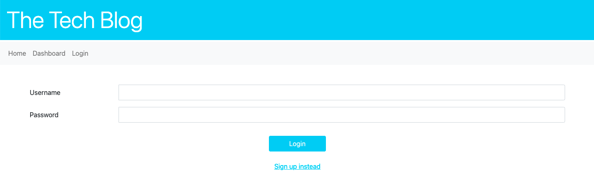

# 14 Model-View-Controller (MVC): Tech Blog

Table of content

- [14 Model-View-Controller (MVC): Tech Blog](#14-model-view-controller-mvc-tech-blog)
- [Description](#description)
- [Building Structure](#building-structure)
- [Screenshots](#screenshots)
- [Tech/Framwork used](#techframwork-used)
- [Repositery content + link](#repositery-content--link)

# Description

This application allows - by using a back-end working with Express.js API and Sequelize to interacht with the MySQL database - an user to have a back end for a e-commerce website. For now - for demonstration purposes, see walkthrough video - the application code is functional on the developers machine (MySQL login/.env).

The application itself containes a database with different tables (models) for different item categories, products and tags. The tables are partly linked to each other and a basic data is given by the seeds files.

The User can check the database, can add, delete and update data through the commandline or rather by using a API Design Platform like insomnia.rest.

# Building Structure

The starter code has been modified as followw:

- Install all dependencies ("dotenv", "express", "mysql2", "sequelize")
- Setting up the server.js file to get the server running by using "sequelize"
- Database login gets supported by an .env file
- Setting up the database by completing the database models as requiered
- The connection file establishes the database connection by using "sequelize" in node.js, the .env as well as by naming the host (localhost) and dialect (MySQL)
- The API routes are setting up the relation between the tabels and the requests (get, post, put and delete) by using express.js

# Screenshots

# Tech/Framwork used

- Node.js
- npm packages: require, bcrypt, connect-session-sequelize dotenv, express, express-handlebars, express-session, moment, sequelize
- JavaScript
- mySQL2

# Repositery content + link

- config
  - connection.js
- controllers
  - api
    - comment_routes.js
    - index.js
    - post_routes.js
    - user_routes.js
  - home_routes.js
  - index.js
- db
  - schema.sql
- helpers
  - index.js
- image
  - 1-Screenshot.png
- models
  - Comment.js
  - index.js
  - Post.js
  - User.js
- node_modules
  - ...
- public
  - css
  - js
    - comment.js
    - delete-post.js
    - login.js
    - post.js
    - singup.js
- seeds
  - comment-seeds.js
  - index.js
  - post-seeds.js
  - user-seeds.js
- views
  - layouts
    - main.handlebars
  - partials
    - private-navbar.handlebars
    - public-navbar.handlebars
  - comment-post.handlebars
  - dashboard.handlebars
  - home.handlebars
  - login.handlebars
  - newpost.handlebars
  - show-post-comment.handlebars
  - singup.handlebars
- .env
- .gitignore
- package-lock.json
- package.json
- README.md
- server.js

- GitHub (dev branch): https://github.com/JenBerlin/Employee-Tracker/pull/1
- Heroku: ...
